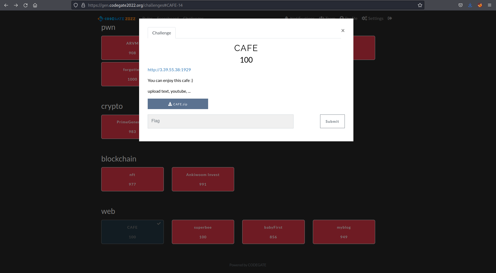
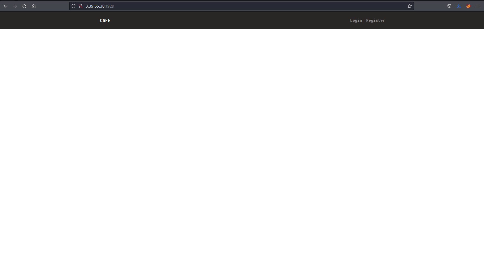
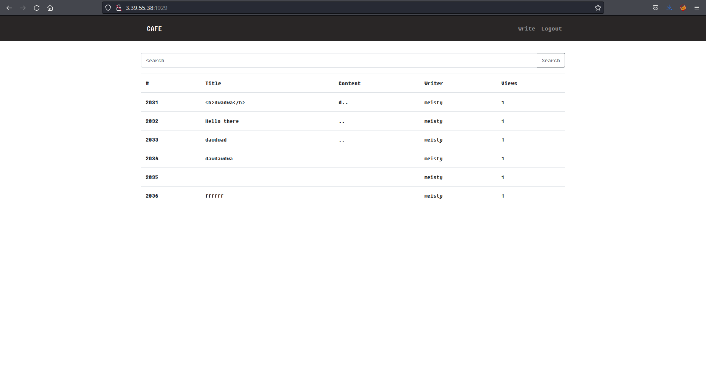
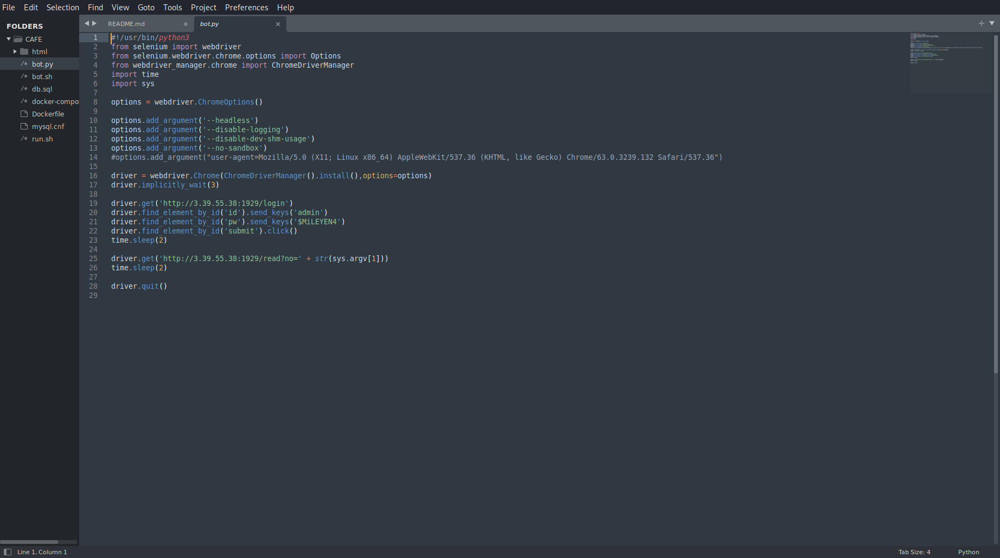
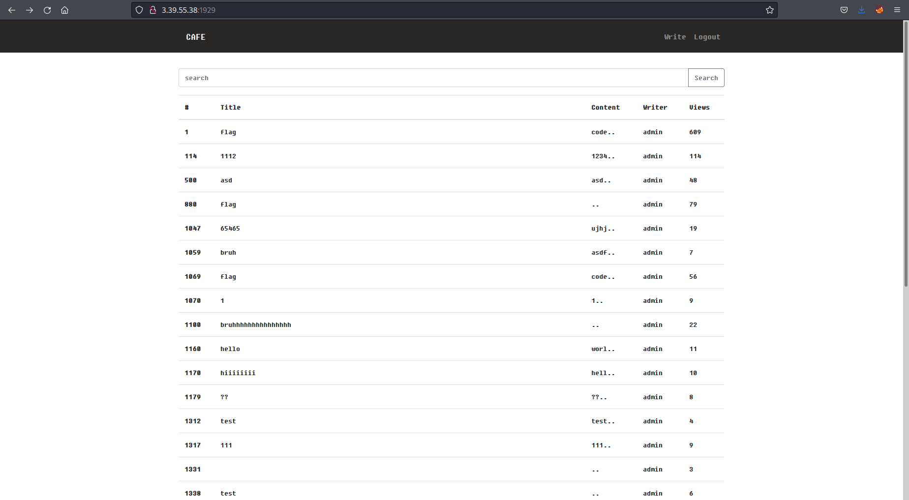
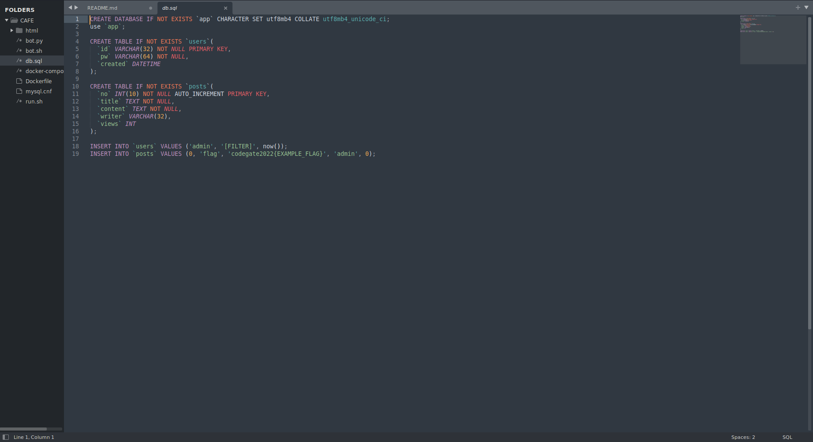
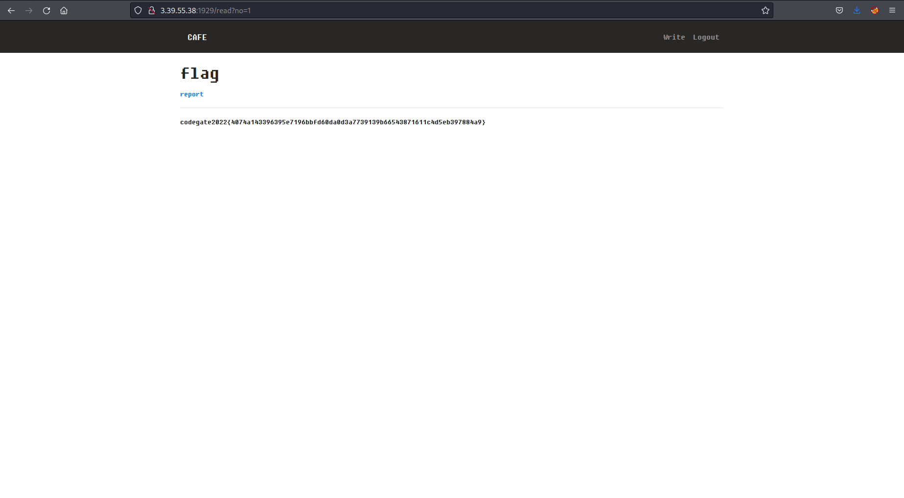

# Web Challenge - Cafe

Challenge Description:
--------------------------

```
You can enjoy this cafe :)

upload text, youtube, ...
```

[](images/challenge.png)

With a file to zip file to download.  

I downloaded the file and then started to look at the website.  

[](images/home.png)

I registered an account and tried to acquire a cookie from an admin who may be logging in and looking at the page.  This did not work.  

[](images/my_user.png)

I then checked the zip file I had downloaded.  Unzipped it and had a read through some of the files.  

What caught my interest in the `bot.py` file was potential admin credentials.  

[](images/admin_creds.png)

I tried those on the website and sure enough I was logged in.

[](images/admin_home.png)  

Looking at the file `db.sql` I could see the flag would be stored in a post entitled `flag` so I viewed the first post with this and found the flag.

[](images/flag_location.png)

[](images/flag.png)