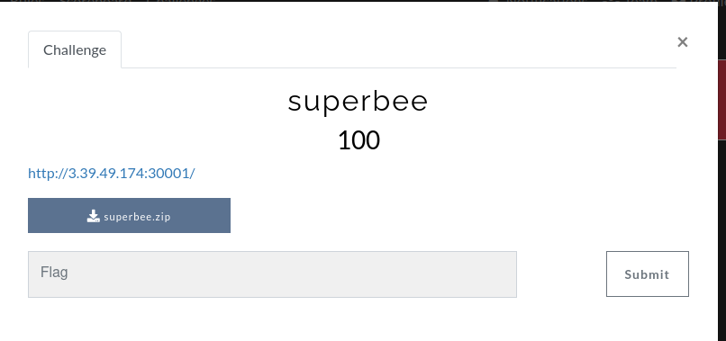
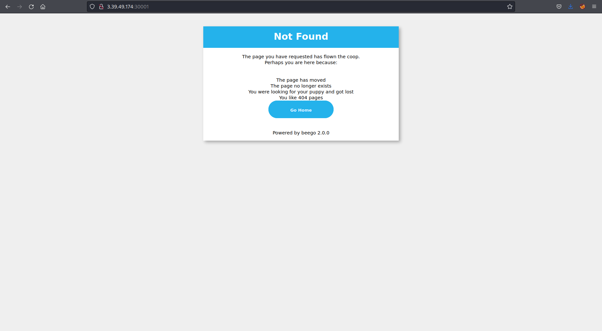
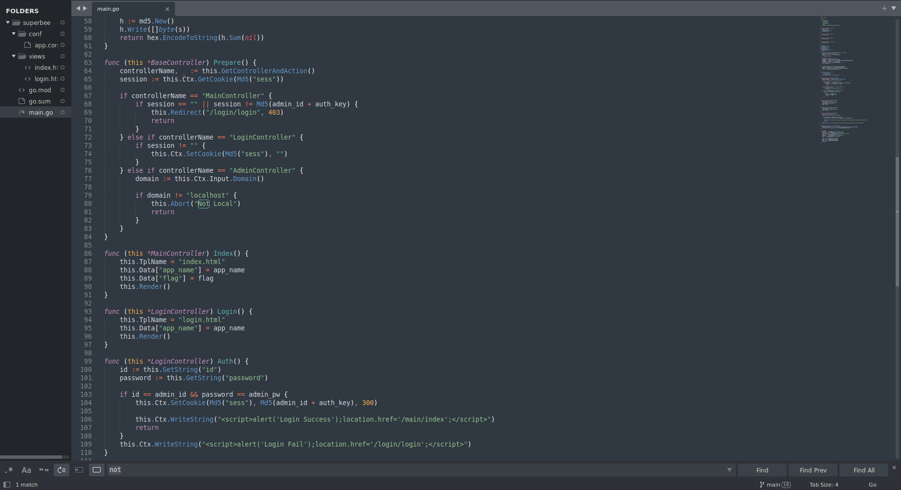
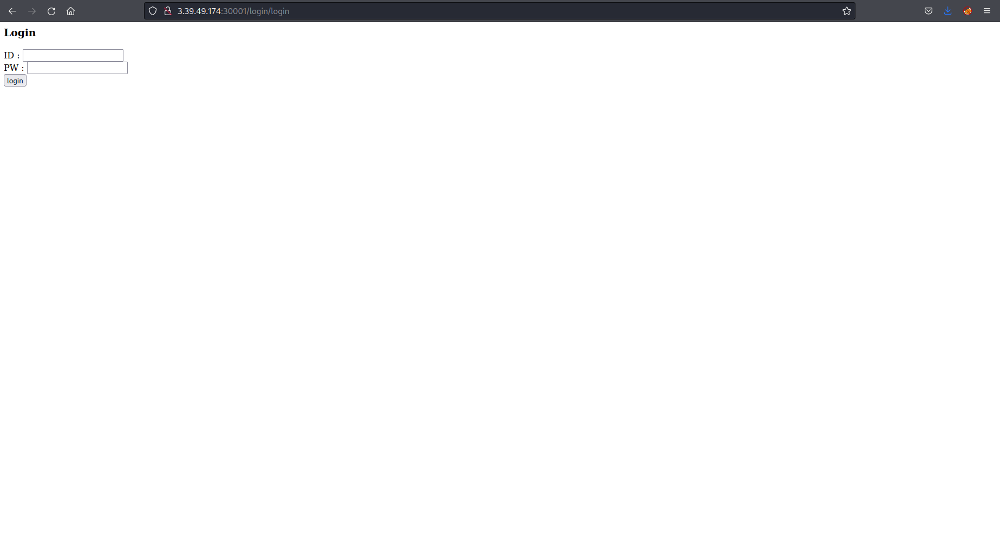
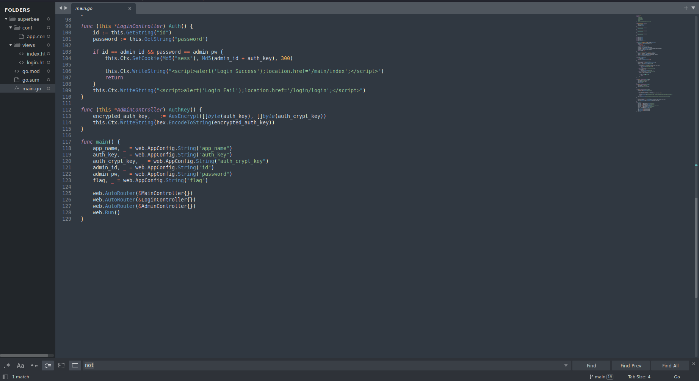
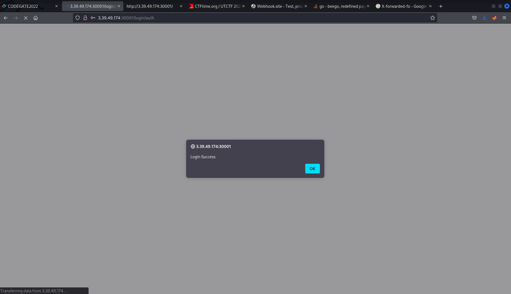
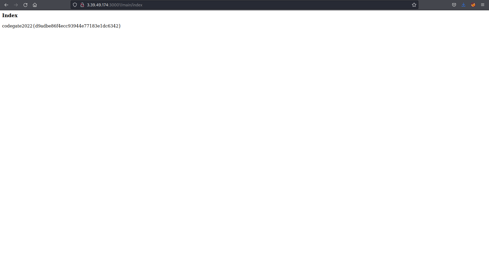

# Web Challenge - Superbee

With a file to zip file to download.  

I downloaded the file and then started to look at the website.  

Initially I couldn't see anything, just the 404 page.  

I took a look at the code and noticed there was a potential url of `/login/login`.  

I tried the url, success. 

I tried some username and password combinations with no success.  After looking at the code again I noticed potential credentials to try:  

I tried those on the website and sure enough I was logged in.

Once logged in I was greeted with the flag.

