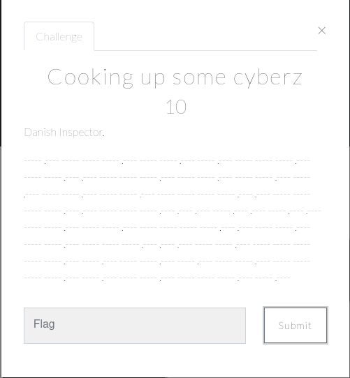
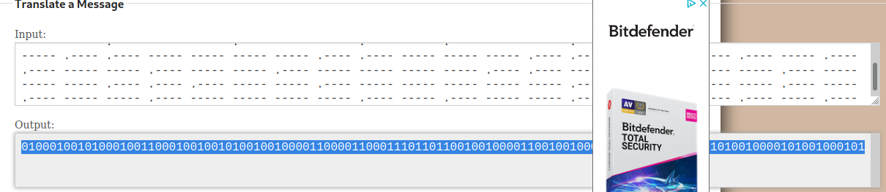
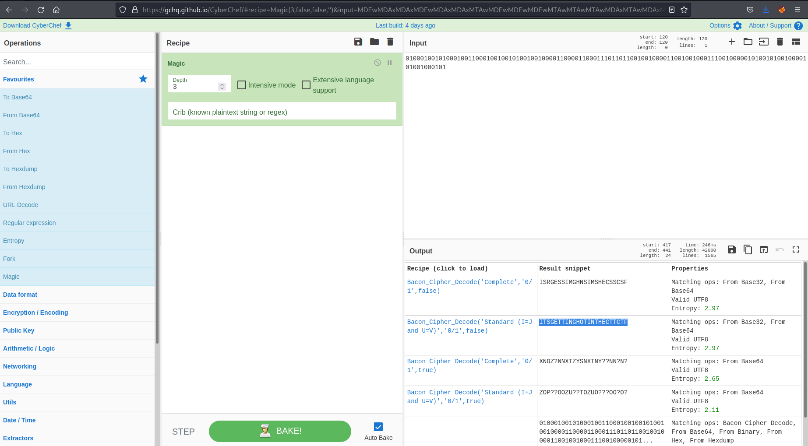

# Cryptography

## Cooking up some Cyberz

This was an easy 10 point challenge and the only challenge I attempted in this category.  Cryptography is not my strong point and is something I need to improve in the future. 

From the challenge description you are given what appears to be lines and dots.

My initial thought was this was some kind of encoding that I needed to decode. But then I realised it was morse code, with the lines and dots. 

I headed over to an online tool to try and decipher the morse code:

From the tool I got a load of 1s and 0s.  When put into [cyberchef](https://gchq.github.io/CyberChef/) and with the magic recipe you can see the flag `ITSGETTINGHOTINTHECTTCTF`

