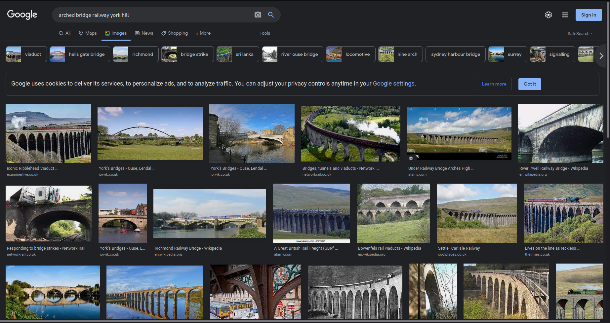
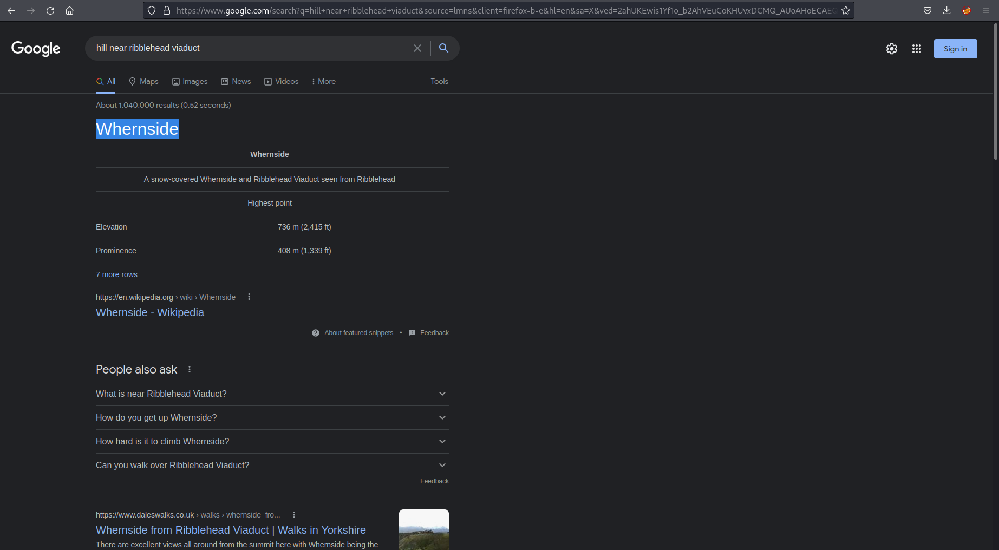

# Forensics

## PDFCrypt

I downloaded the PDF and attempted to open it.  It asked for a password. 

I generated a hash using pdf2john and then used john with rockyou.txt to brute force the password for the pdf.

Upon opening the PDF you can see the flag.

## The Hills are alive!

All that is provided is an image which is .HEIC format. I was not able to open it. 

I found a tool online which allowed me to convert the image into a JPG

After putting the image through a google image reverse search I didn't really find much.  I looked closely at the photo and noticed that there was an arched railway bridge to the left of the photo which looked quite unique.  I did a quick google search to see if I could find something.  I used York too as I knew the creators of the CTF were based in that area.

The first image of `Ribblehead Viaduct` looked promising. So I went to google maps to take a look. 

So I was sure this could be it, but the challenge asked for the hill the photo was taken from. I couldn't see anything on google maps so one more google search was required to get the flag.

