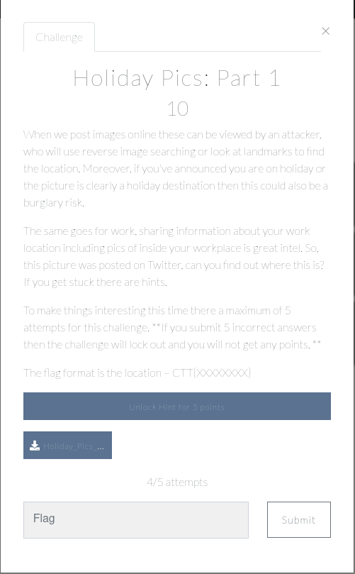
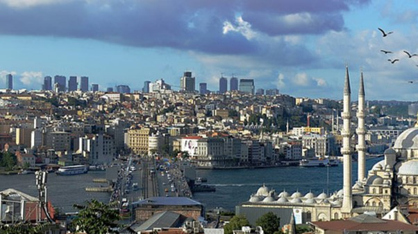
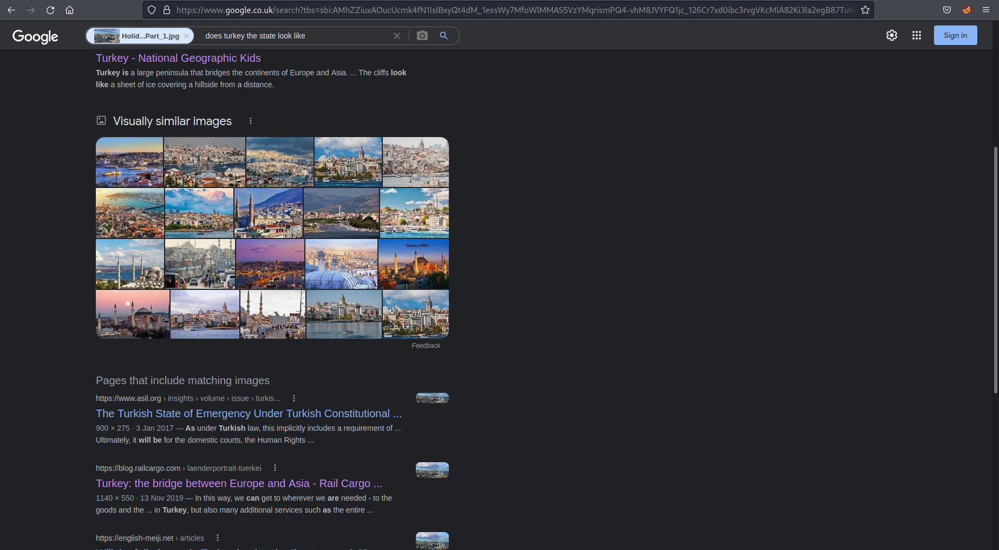
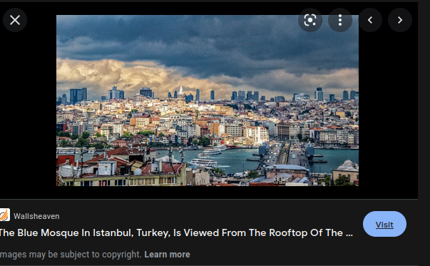
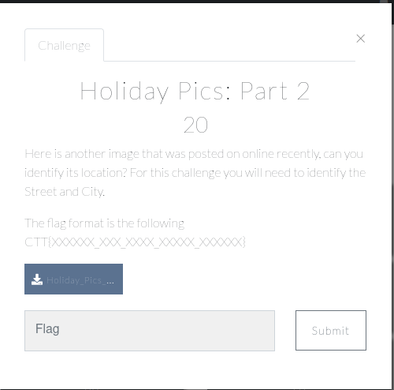
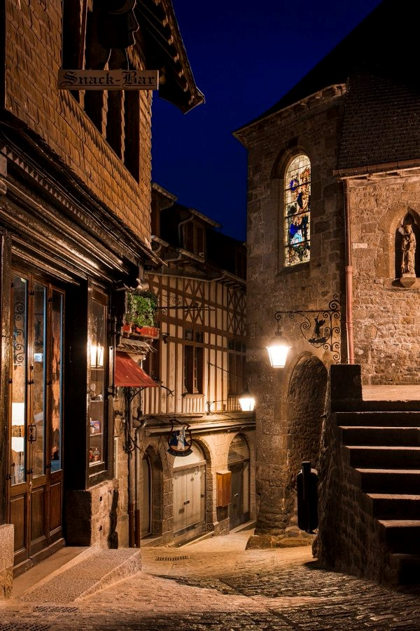
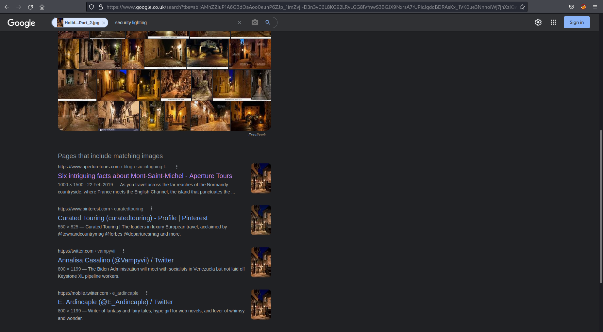
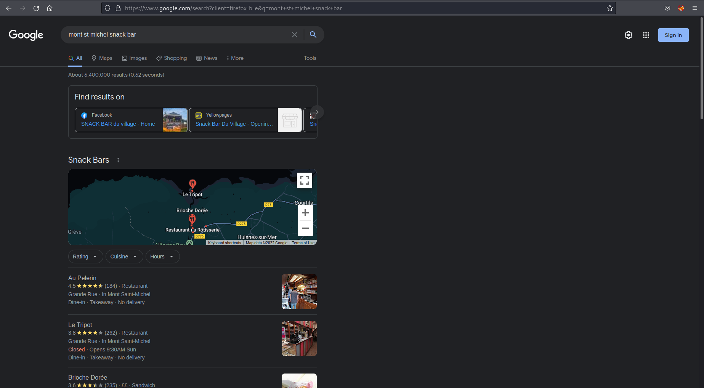
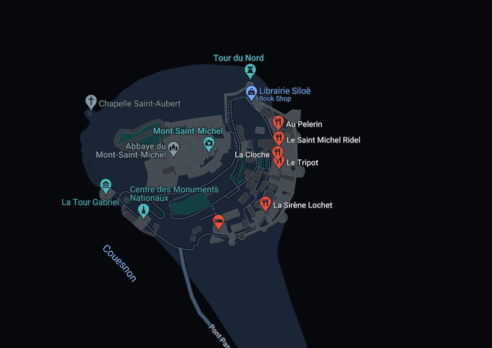
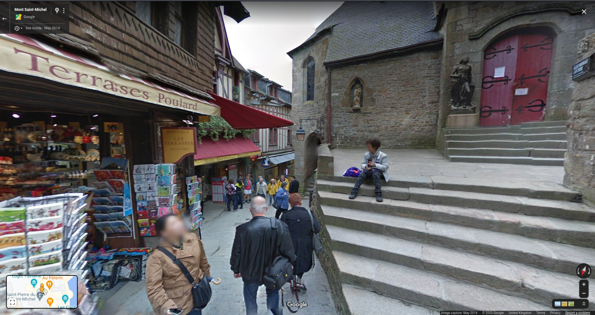

# OSINT

## Holiday Pics: Part 1

All that was provided was the following image

I have not done a lot of OSINT in the past but I knew you could reverse google image search with the image.  So I tried it:

So looks like it could be in Turkey.  I looked at some of the images and some of the webpages and came to the conclusion it could be Istanbul, perhaps. Then this image helped me feel 100% this was the case before submitting my answer:

## Holiday Pics: Part 2

Another image to try and work out the street name and place.  Looks nice:

A quick google image search later and it looks like its in Mont Saint Michel. 

The only thing that stood out from the initial image for me was the words `snack bar` so I tried to narrow down the locations it could be

By this point I thought I had the right answer but I took to google maps to see if I could find the exact spot.  And I found it. 

The adrenaline rush after solving these OSINT challenges has really opened my eyes to this category and I look forward to trying to solve more in the future. 