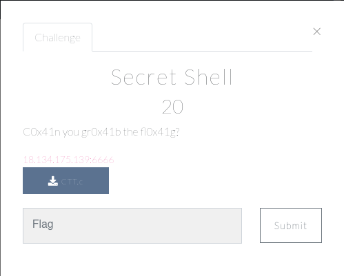

# PWN

## Secret Shell

[](img/holiday_photo1_chall.png)

After looking at the c file that could be downloaded, I realised this was a simple buffer overflow challenge.  I generated a payload which would exceed the expected buffer and then connected to the ip via the terminal and nc.

```
nc 18.134.175.138 6666
```

[](img/secret_shell_buffer.png)

 (I was a noob and didn't take a screenshot of the actual flag and exploit).  But when prompted to provide user input, I passed the above string which overflowed the buffer and printed out the flag to the screen.
