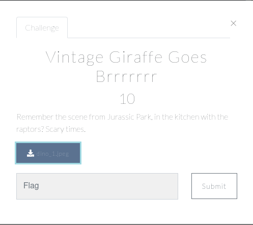
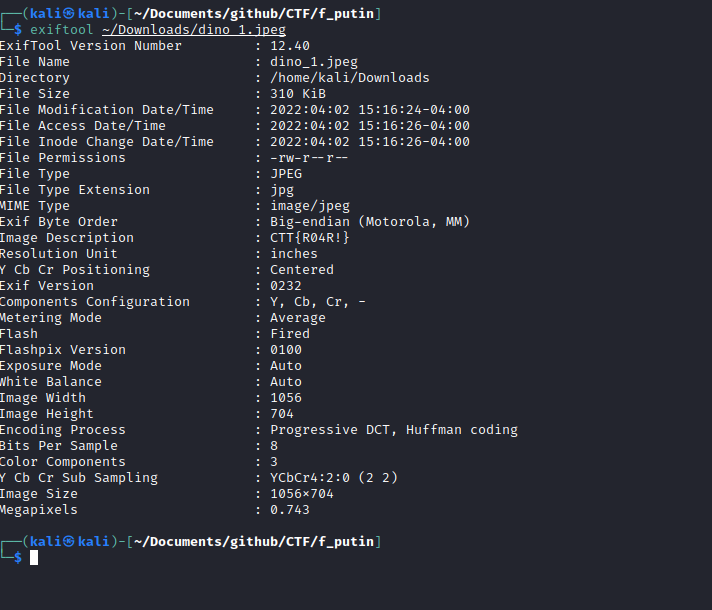

# Steganography

## Vintage Giraffe goes brrrrrr

For a steganography challenge my first point of call is to take a closer look at the image with exiftool.  And there was the flag in the metadata. 

