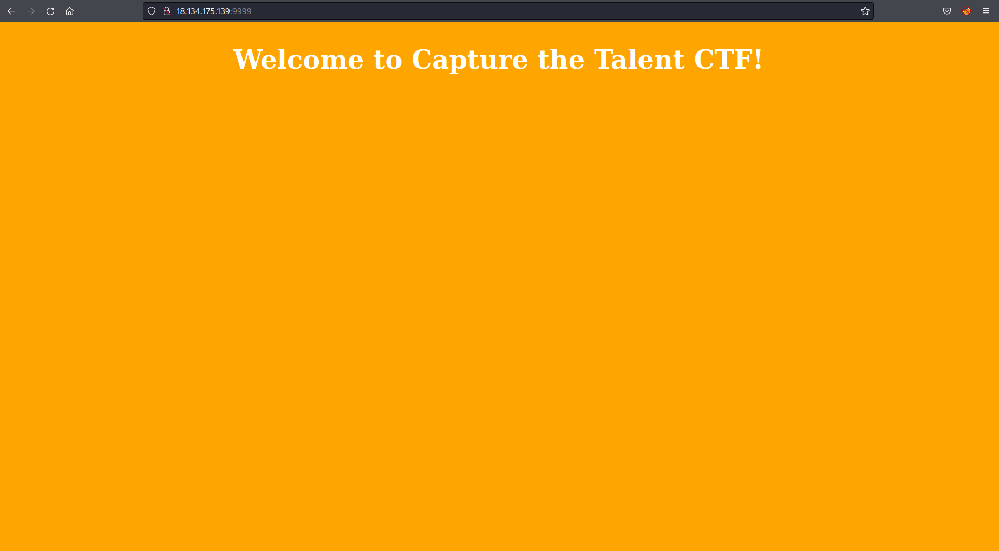
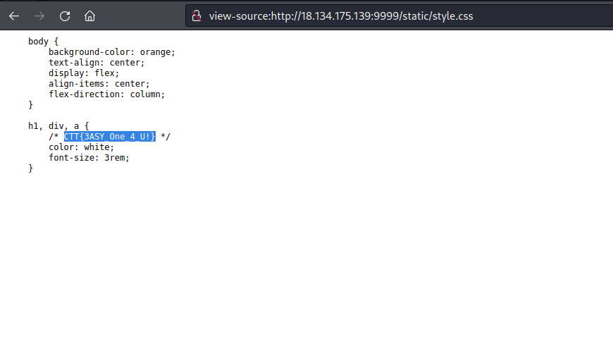

# Web

## Sunday Morning

Taking a look at the page there was not much of interest so checked robots.txt, nothing.  Then its always worth checking any asset files such as js or css in case something is hidden in there.  There was the flag in the css file.

