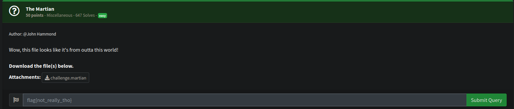
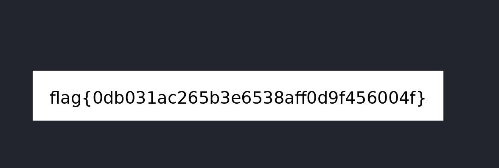

# Misc

## The Martian

[](themartianchall.png)

You are provided with a file `challenge.martian`.  

After some googling turns out it may be a `.mar` file which is a file related to mozilla firefox which is just like a zip file.  

I was able to extract the data using 7z.

```bash
mv challenge.martian challenge.mar

7z x challenge.mar
```

This gave me a file `challenge`.  Using file we can see its a jpg file. 

```bash
file challenge        
challenge: JPEG image data, JFIF standard 1.01, aspect ratio, density 1x1, segment length 16, baseline, precision 8, 968x118, components 3
```

Opening it shows us the flag.

[](challflag.png)
