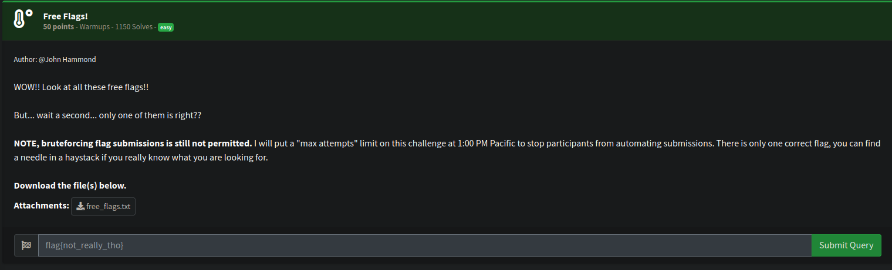
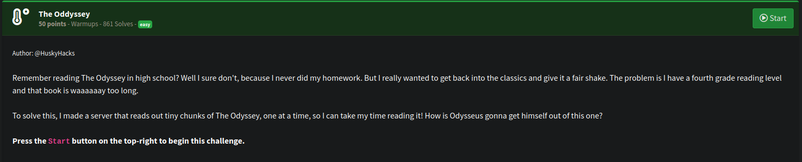
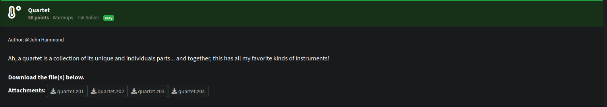

# Warmup Challenges

## Free Flags

[](freeflagschall.png)

We were given a file containing so many flags, but only one of them was valid.  

Looking at the rules of the CTF you can see the format the flag should be in:

```
Flags for this competition will follow the format: flag\{[0-9a-f]{32}\}. 
```

So with a python script we can discover the valid flag

```python
import re

with open('free_flags.txt', 'r') as f:
    data = f.read()

# Regex pattern to match only correct flags
pattern = r'flag\{[0-9a-f]{32}\}'

# Find all matches
valid_flags = re.findall(pattern, data)

# Print the valid ones
print("Valid flags:")
for flag in valid_flags:
    print(flag)
```

```bash
python3 flags.py   
Valid flags:
flag{ae6b6fb0686ec594652afe9eb6088167}
```

## The Oddyssey

[](oddysseychall.png)

A server to connect to via nc is provided.  Connecting just allows us to press enter to print out excerpts of text. 

```bash
nc challenge.nahamcon.com 32232
BOOK I Tell me, O muse, of that ingenious hero who travelled far and wide after he had sacked the famous town of Troy. Many cities did he visit, and many were the nations with whose manners and customs he was acquainted; moreover he suffered much by sea while trying to save his own life and bring his men safely home; but do what he might he could not save his men, for they perished through their own sheer folly in eating the cattle of the Sun-god Hyperion; so the god prevented them from ever reaching home. Tell me, too,

Press enter to continue...

about all these things, O daughter of Jove, from whatsoever source you may know them. So now all who escaped death in battle or by shipwreck had got safely home except Ulysses, and he, though he was longing to return to his wife and country, was detained by the goddess Calypso, who had got him into a large cave and wanted to marry him. But as years went by, there came a time when the gods settled that he should go back to Ithaca; even then, however, when he was among his own people, his troubles were not yet over;

Press enter to continue...
```

I suspected the flag was in there somewhere, so created a python script to connect and press enter checking for `flag{` in the output.

```python
import socket
import time

host = "challenge.nahamcon.com"
port = 32232

s = socket.socket()
s.connect((host, port))

try:
    while True:
        s.send(b"\n")  # Simulate pressing enter
        time.sleep(0.2)  # Wait a bit for the server to respond
        chunk = s.recv(4096)
        print(chunk.decode(), end="")
        if b"flag{" in chunk:
            break
finally:
    s.close()
```

```bash
python3 exploit.py

<SNIP>

Press enter to continue...
hanging about the <SNIP>, "flag{0b51aae6b09b85d1bb13b0b8c3003a6a}". Penelope remarked "that's kind of a weird thing to say in this context." To which Ulysses responded "yeah I don't know, it kinda just came to me ¯\_(ツ)_/¯" Then Ulysses said "My good woman, why should you be so angry with me? Is it because I am not clean, and my clothes are all in rags, and because I am obliged to go

Press enter to continue...
```

## Quartet

[](quartetchell.png)

4 `.z0x` files were provided. But checking the files with `file` we can see one of them is slightly different. 

```bash
file quartet.z01
quartet.z01: Zip multi-volume archive data, at least PKZIP v2.50 to extract


file quartet.z04
quartet.z04: Zip archive data, made by v3.0 UNIX, extract using at least v2.0, last modified May 10 2025 04:28:04, uncompressed size 2035495, method=deflate
```

After some googling it turns out this is a multi-volume zip file.  So I renamed quartet.z04 to quartet.zip and was able to extract data. 

```bash
mv quartet.z04 quartet.zip

7z x quartet.zip      

7-Zip 24.09 (x64) : Copyright (c) 1999-2024 Igor Pavlov : 2024-11-29
 64-bit locale=en_US.UTF-8 Threads:1 OPEN_MAX:1024, ASM

Scanning the drive for archives:
1 file, 504098 bytes (493 KiB)

Extracting archive: quartet.zip
--
Path = quartet.zip
Type = zip
Physical Size = 504098
Embedded Stub Size = 4
Total Physical Size = 2030882
Multivolume = +
Volume Index = 3
Volumes = 4

Everything is Ok

Size:       2035495
Compressed: 2030882

```

We now have quartet.jpeg.  And upon opening the image.

[](quartetjpeg.png)

Must be something hidden in this image.  Lets take a look with xxd.

```bash
xxd quartet.jpeg | grep flag -a10
000f86e0: 8df3 e87a 5fa9 92cd 7ef5 ff00 8557 bf4e  ...z_...~....W.N
000f86f0: dcff 0092 3949 857e 8c42 68ed 2a7f 1373  ....9I.~.Bh.*..s
000f8700: 2f5b b68f 56b8 d437 8c4a a20a ae75 169b  /[..V..7.J...u..
000f8710: eb2c b8cc 552e eaf7 1338 d4dc c71b f4e3  .,..U....8......
000f8720: d0ea 964a c67d 4a36 5c6f 4fa5 956d 41a3  ...J.}J6\oO..mA.
000f8730: bfa5 7586 845b 6387 138a ff00 e29f fd5e  ..u..[c........^
000f8740: 3bc1 adea 5bbe 278d 40cc 0d9d 4b6f b4f0  ;...[.'.@...Ko..
000f8750: e279 d427 99e7 5032 fa5a 6794 1b99 ccbc  .y.'..P2.Zg.....
000f8760: 8133 74fa 5b75 736a 9df9 9ccc 7338 c6a5  .3t.[usj....s8..
000f8770: e2e1 7799 8dbb fdda 37fe 49af f0bf ffd9  ..w.....7.I.....
000f8780: 666c 6167 7b38 6636 3637 6230 3964 3065  flag{8f667b09d0e
000f8790: 3832 3166 3465 3134 6435 3961 3830 3337  821f4e14d59a8037
000f87a0: 6562 3337 367d 0aff d8ff e000 104a 4649  eb376}.......JFI
000f87b0: 4600 0101 0000 0100 0100 00ff db00 8400  F...............
000f87c0: 0101 0101 0101 0101 0101 0101 0101 0101  ................
000f87d0: 0101 0101 0101 0101 0101 0101 0101 0101  ................
000f87e0: 0101 0101 0101 0101 0101 0102 0202 0202  ................
000f87f0: 0202 0202 0202 0303 0303 0303 0303 0303  ................
000f8800: 0101 0101 0101 0102 0101 0202 0201 0202  ................
000f8810: 0303 0303 0303 0303 0303 0303 0303 0303  ................
000f8820: 0303 0303 0303 0303 0303 0303 0303 0303  ................
```
