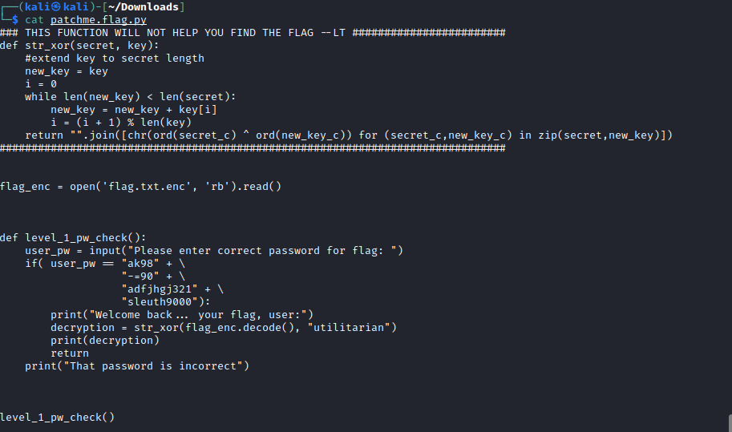
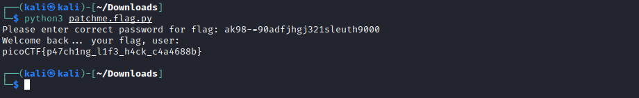

# PicoCTF2022

## Reversing

### Patch me py

This challenge told me to run the python file in the same directory as the encrypted flag.  When running it asked me for a password.  I entered in password, no luck. 

I then viewed the source of the python file and the password was there. 

I constructed the password, ran the python3 file again and entered the password. 

