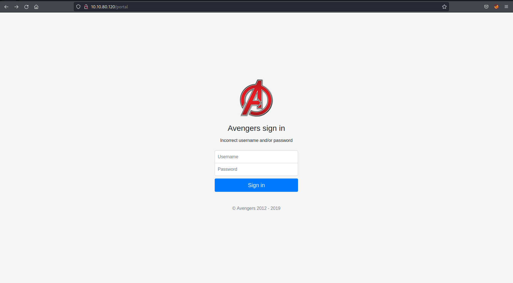

# Avengers Blog

This was an interesting ctf type challenge which involved a couple of vulnerabilities.

```
On the deployed Avengers machine you recently deployed, get the flag1 cookie value.
```

Upon viewing the cookies in the developer tools within Firefox the first flag can be found. 

```
Look at the HTTP response headers and obtain flag 2.
```

Looking at the HTTP headers in the response when the page is loaded you can see flag2. 

```
Look around the FTP share and read flag 3!
```

This flag involved a couple of steps.  The first which is hinted at is that you can find the potential password of the groot user from looking through the comments on the website itself. 

[](images/ftp_creds.png)

Upon finding these I had to determine where they could be used.  After running an nmap scan you can see FTP and SSH ports are open.  

[](images/nmap.png)

After logging in a looking around you find flag3. 

```
What is the directory that has an Avengers login?
```

Running a gobuster scan shows that there is a `portal` page which can be accessed. 

[](images/portal.png)

```
Log into the Avengers site. View the page source, how many lines of code are there?
```

The portal page is able to be bypassed with some sql injection `' 1=1`.  There were 223 lines of code.

```
Read the contents of flag5.txt
```

Once logged in you are shown a field where commands can be run directly on the machine.  After looking around you find the flag but when trying to read the file with `cat` you see that command is blocked.  So by running the same command with `less` you can read the contents of the flag. 

[](images/final_flag.png)