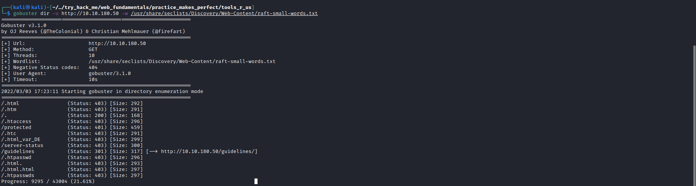
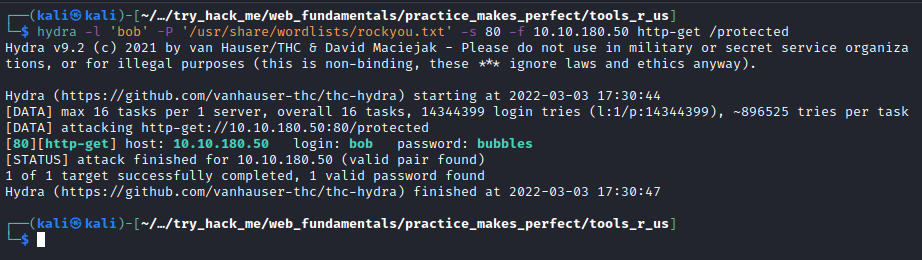
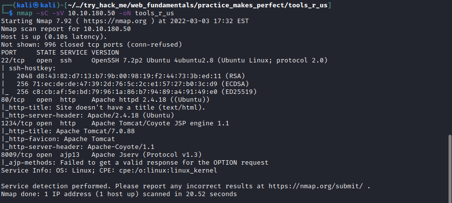
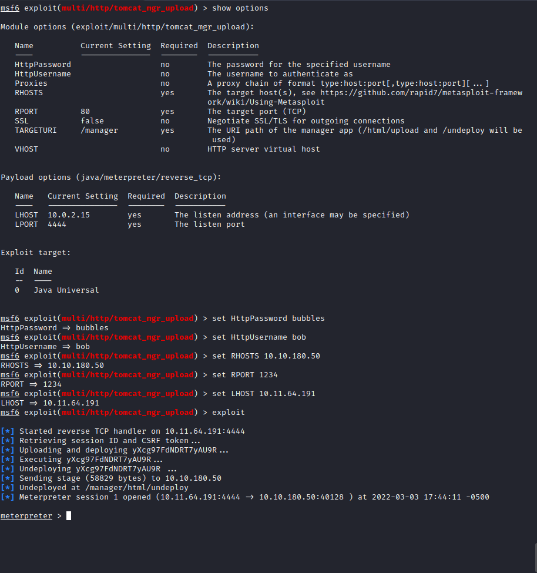

# Tools R us

```
What directory can you find, that begins with a "g"?
```
Upon running a gobuster scan you can see that the `guidelines` directory is visible. 

[](images/gobuster.png)

```
Whose name can you find from this directory?
```

After browsing to the page you can see the answer is `bob`.

```
What directory has basic authentication?
```

From the above gobuster scan you can see its `protected`. 

```
What is bob's password to the protected part of the website?
```

So I decided to try bruteforce bobs password using Hydra and very quickly found the password `bubbles`. 

[](images/hydra.png)

```
What other port that serves a webs service is open on the machine?
```

`1234`

[](images/nmap.png)

```
Going to the service running on that port, what is the name and version of the software?

Answer format: Full_name_of_service/Version
```

`Apache Tomcat/7.0.88`

```
Use Nikto with the credentials you have found and scan the /manager/html directory on the port found above.

How many documentation files did Nikto identify?
```

`5`

```
What is the server version (run the scan against port 80)?
```

`Apache/2.4.18`

```
What version of Apache-Coyote is this service using?
```

`1.1`

```
Use Metasploit to exploit the service and get a shell on the system.

What user did you get a shell as?
```

So I looked around for known vulnerabilities and found within metasploit `multi/http/tomcat_mgr_upload`.  Upon exploiting this vulnerability I had a shell as `root`

[](images/metasploit.png)


```
What text is in the file /root/flag.txt
```

`ff1fc4a81affcc7688cf89ae7dc6e0e1`